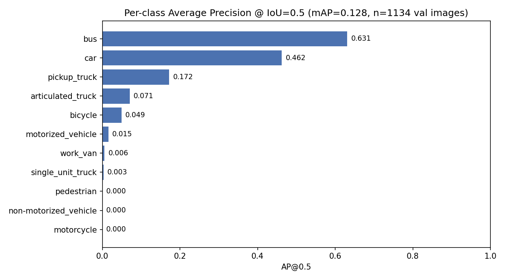
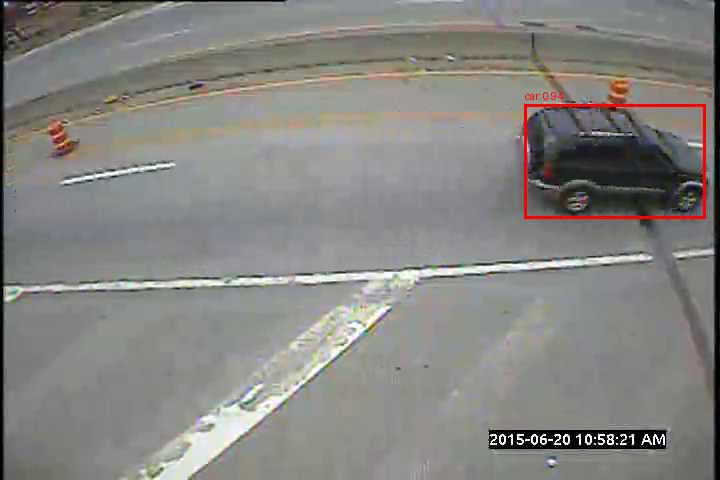
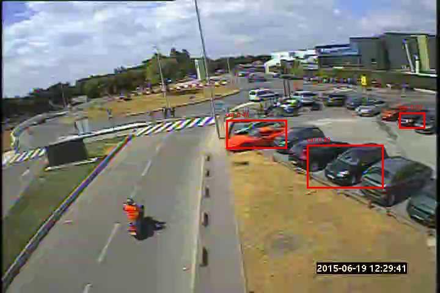

# 🚗 Autonomous Driving using Deep Learning & Data Analysis

[](https://github.com/PrakharSri18-data/Autonomous-Driving-Deep-Learning/actions/workflows/ci.yml)

An end-to-end AI/ML project combining **object detection** and **data analysis** to simulate two components of an autonomous driving stack:

- **Part 1 → Vehicle Detection** — Faster R-CNN (MobileNetV3 backbone) trained on the [MIO-TCD](http://podoce.dinf.usherbrooke.ca/) traffic-camera localization dataset
- **Part 2 → Tesla Autopilot Incident Analysis** — EDA on real-world autopilot-involved accident data

---

## 📈 Results (real, measured — not projected)

Evaluated on **1,134 held-out validation images** (from a 5,626-image subset of MIO-TCD; see [Dataset](#-dataset) below for why it's a subset), IoU threshold 0.5, confidence threshold 0.5:

| Metric | Value |
|---|---|
| Precision | 0.685 |
| Recall | 0.296 |
| mAP@0.5 (all classes) | 0.128 |
| Inference latency (CPU) | ~335 ms/image (≈3 FPS) |

**Per-class AP@0.5:**

| Class | AP@0.5 |
|---|---|
| bus | 0.631 |
| car | 0.462 |
| pickup_truck | 0.172 |
| articulated_truck | 0.071 |
| bicycle | 0.049 |
| motorized_vehicle | 0.015 |
| work_van | 0.006 |
| single_unit_truck | 0.003 |
| motorcycle | 0.000 |
| non-motorized_vehicle | 0.000 |
| pedestrian | 0.000 |

**Honest read of these numbers:** the model has clearly learned the two highest-frequency, highest-visual-contrast classes (`bus`, `car`) but has not converged on rare or small/low-contrast classes (`pedestrian`, `motorcycle`, `non-motorized_vehicle` score ~0). Recall (0.30) is the weaker of the two headline metrics — the model misses more vehicles than it catches, consistent with training on only ~500 images for a handful of epochs, no learning-rate schedule, and heavy class imbalance in the underlying dataset. This is a checkpoint from an early, resource-constrained training run, not a tuned final model — see [Limitations](#️-limitations--next-steps).



**Example outputs (real inference, unmodified — not cherry-picked for success only):**

| Confident correct detection | Honest failure case |
|---|---|
|  |  |
| Car detected at 0.94 confidence. | Parked cars detected correctly, but the motorcyclist in the road (left side) is missed entirely — this is exactly what the 0.000 AP on `motorcycle` in the chart above predicts. |

Full metrics (incl. TP/FP/FN counts): [`models/eval_metrics.json`](models/eval_metrics.json), reproducible via `evaluation.py` (see [How to Run](#-how-to-run)).

---

## 🏗️ Architecture

```
labels.csv (351k box annotations, 110k images, 11 classes)
        │
        ▼
data_ingestion.py ──► train.csv / val.csv (80/20 split by image_id)
        │                     + classes.json (single source of truth
        │                       for label→index, shared by every stage)
        ▼
train.py ──► VehicleDataset ──► Faster R-CNN (MobileNetV3-Large-320-FPN backbone)
        │         (dataset.py)         (model.py, ImageNet-pretrained, fine-tuned head)
        ▼
models/vehicle_detector.pth + training_history.json (train/val loss per epoch)
        │
        ├──► evaluation.py ──► precision/recall + per-class AP + mAP@0.5 (metrics.py)
        │                       └─► models/eval_metrics.json
        │
        └──► inference.py ──► annotated image (outputs/<name>.jpg)
```

`config.py` centralizes every path and hyperparameter; every script also accepts CLI flags (`--epochs`, `--batch-size`, `--iou-threshold`, etc. — run any script with `--help`).

---

## ⚙️ Model Details

- Architecture: **Faster R-CNN**
- Backbone: **MobileNetV3-Large-320-FPN** (torchvision pretrained weights, fine-tuned classification head)
- Task: multi-class object detection (11 vehicle/pedestrian classes + background)

---

## 📦 Dataset

Labels come from the **MIO-TCD Localization dataset** (Miovision Traffic Camera Dataset) — 110,000 images, 11 classes (`car`, `pickup_truck`, `bus`, `pedestrian`, `bicycle`, `motorcycle`, `articulated_truck`, `single_unit_truck`, `work_van`, `motorized_vehicle`, `non-motorized_vehicle`), CSV format `image_id,label,xmin,ymin,xmax,ymax`.

**The `Images/` folder is intentionally not committed** — it's gitignored (see `.gitignore`) because the full dataset is tens of GB and requires registration with the dataset provider. The results above were produced on a locally-downloaded **5,626-image subset**. To reproduce:

1. Register and download images from the MIO-TCD localization challenge.
2. Place them under `Datasets & Problem Statement/Part 1/Images/` (filenames zero-padded to 8 digits, e.g. `00000001.jpg`, matching the `image_id` column).
3. Run the pipeline below.

### Part 2
Tesla autopilot accident dataset (`Tesla - Deaths.csv`) — date, location, deaths, autopilot involvement, vehicle/collision details.

---

## 🚀 How to Run

```bash
git clone https://github.com/PrakharSri18-data/Autonomous-Driving-Deep-Learning.git
cd Autonomous-Driving-Deep-Learning

python -m venv venv
venv\Scripts\activate        # source venv/bin/activate on Linux/Mac
pip install -r requirements.txt

cd src/part1DeepLearning
python data_ingestion.py                 # writes data/{train,val}.csv + classes.json
python train.py --epochs 5               # writes models/vehicle_detector.pth
python evaluation.py                     # writes models/eval_metrics.json
python inference.py --image-path <path-to-image.jpg>
```

Every script exposes `--help` for the full set of CLI overrides (paths, epochs, batch size, thresholds).

### Docker
```bash
docker build -t vehicle-detector .
docker run -v "${PWD}/Datasets & Problem Statement:/app/Datasets & Problem Statement" \
           -v "${PWD}/models:/app/models" \
           vehicle-detector train.py --epochs 5
```

### Tests
```bash
pip install -r requirements-dev.txt
pytest tests/ -v      # 14 tests: metrics correctness (IoU/precision/recall/mAP)
                       # + a regression test for the class-index bug fixed below
ruff check src tests
```
CI (`.github/workflows/ci.yml`) runs both on every push/PR.

---

## 🏗️ Project Structure
```
src/part1DeepLearning/
  config.py          # paths + hyperparameters (single source of truth)
  dataset.py          # shared VehicleDataset + classes.json persistence
  utils.py             # seeding, logging
  metrics.py           # IoU, precision/recall, per-class AP + mAP@0.5
  model.py             # Faster R-CNN / MobileNetV3 architecture
  data_ingestion.py    # CSV split + class mapping
  train.py             # training loop, best-checkpoint saving, loss history
  evaluation.py         # metrics computation against val set
  inference.py          # single-image prediction + visualization
tests/                # pytest suite (metrics + dataset correctness)
.github/workflows/ci.yml
Dockerfile
```

---

## 🐛 A real bug this refactor fixed

The original version of this project recomputed `class_to_idx` independently inside `train.py`, `evaluation.py`, and `inference.py` — each one derived it from whichever CSV *that script* happened to load. If a class was missing from one split's rows (entirely plausible with an imbalanced 11-class dataset), the label→index mapping would silently shift, corrupting metrics without raising an error. It's now built once from the full label set in `data_ingestion.py`, persisted to `data/classes.json`, and loaded — never recomputed — by every downstream stage. `tests/test_dataset.py::test_vehicle_dataset_uses_shared_class_mapping_not_split_local` is a regression test for exactly this.

The original `requirements.txt` also listed TensorFlow/Keras despite the entire codebase being PyTorch/torchvision — installing from it would have pulled the wrong deep learning framework entirely and none of the scripts would run. Fixed to match actual imports.

---

## ⚠️ Limitations & Next Steps

- **Training data volume**: trained on a 500-image cap (`--max-train-images`, see `config.py`) for CPU-feasible training time. Recall (0.30) and near-zero AP on rare classes (`pedestrian`, `motorcycle`) are consistent with this — more images and epochs is the single highest-leverage next step.
- **No LR schedule / augmentation**: SGD with a fixed learning rate, no horizontal flips or color jitter — both are standard, easy wins for detection accuracy.
- **CPU-only inference** (~3 FPS): nowhere near real-time (would need ~10+ FPS for any real driving-relevant use); a GPU or a lighter backbone would be needed for that.
- **Class imbalance unaddressed**: `car` and `bus` dominate the dataset; no class-weighted loss or oversampling is applied yet.
- **Part 1 and Part 2 are not yet integrated** — the accident-data EDA doesn't currently feed back into detection model evaluation (e.g. "does the model perform worse in conditions correlated with Autopilot incidents?").

---

## 🧠 Key Learnings
- End-to-end ML pipeline design (ingestion → train → eval → inference) with a single shared source of truth for class labels
- Object detection with a pretrained torchvision Faster R-CNN, fine-tuning just the classification head
- Writing regression tests for a bug that only manifests as silently-wrong metrics, not a crash
- Real-world data analysis (Tesla autopilot incidents)

---

## 👤 Author
- Prakhar Srivastava
- Data Analyst, Data Scientist & AI Engineer | Machine Learning, Deep Learning & AI Automation Enthusiast
